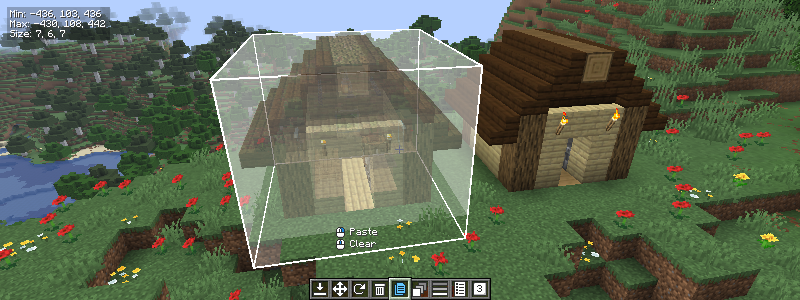

# Simple Blueprints

A simple Minecraft client mod that provides tools for copying and building structures for both creative and survival.

## Common Use Cases

- Pasting a survival build into a creative world
- Building something from a creative world in survival
- See a preview of a build placed in the world before committing to building it
- Sharing a blueprint with multiple players for collaborative builds

## Features

- Copy/paste structures
- Rotate/mirror structures
- Display transparent structures in the world for easy building
- Import/export blueprints
- List the number of items required to build a structure
- Show individual layers of a structure
- Multiple blueprints can be used at a time
- Chat command suggestions for coordinates

## Tools

The toolbar can be opened by pressing the `B` key. This replaces your hotbar with various blueprint tools. A selection must be copied for most tools to be available.

|            Icon            | Description                                        |
|:--------------------------:|----------------------------------------------------|
|      | Makes a selection                                  |
|       | Places a blueprint                                 |
|        | Moves a selection                                  |
|      | Resizes a selection                                |
|      | Rotate/mirror a blueprint                          |
|      | Deletes blocks in a selection                      |
|   | Copy/paste blocks in a selection                   |
|  | Change visibility of blueprints                    |
|      | Change visibility of blueprint layers              |
|   | View the items required for the selected blueprint |
|       | Change/edit blueprint slots                        |
